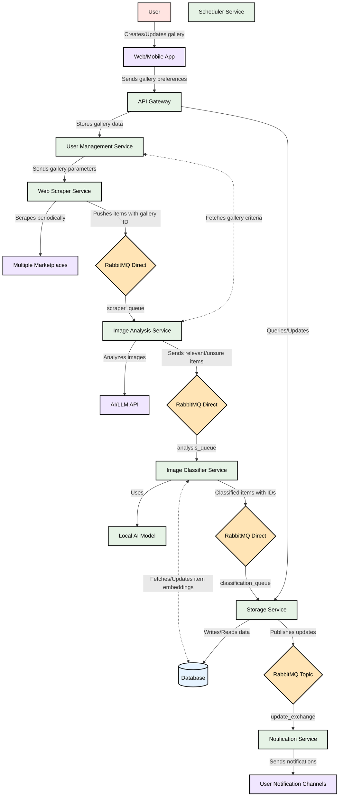

```mermaid
    graph TD
        %% Color definitions
        classDef service fill:#E6F3E6,stroke:#000,stroke-width:2px,color:#000;
        classDef queue fill:#FFE4B5,stroke:#000,stroke-width:2px,color:#000;
        classDef database fill:#E6F3FF,stroke:#000,stroke-width:2px,color:#000;
        classDef external fill:#F0E6FF,stroke:#000,stroke-width:2px,color:#000;
        classDef user fill:#FFE4E1,stroke:#000,stroke-width:2px,color:#000;

        S[User]:::user
        P[Web/Mobile App]:::external
        O[API Gateway]:::service
        Q[User Management Service]:::service
        R[Scheduler Service]:::service
        A[Web Scraper Service]:::service
        B[Multiple Marketplaces]:::external
        C{RabbitMQ Direct}:::queue
        D[Image Analysis Service]:::service
        E[AI/LLM API]:::external
        F{RabbitMQ Direct}:::queue
        G[Image Classifier Service]:::service
        H[Local AI Model]:::service
        I{RabbitMQ Direct}:::queue
        J[Storage Service]:::service
        K[(Database)]:::database
        L{RabbitMQ Topic}:::queue
        M[Notification Service]:::service
        N[User Notification Channels]:::external

        S -->|Creates/Updates gallery| P
        P -->|Sends gallery preferences| O
        O -->|Stores gallery data| Q
        Q -->|Sends gallery parameters| A
        A -->|Scrapes periodically| B
        A -->|Pushes items with gallery ID| C
        C -->|scraper_queue| D
        D <-.->|Fetches gallery criteria| Q
        D -->|Analyzes images| E
        D -->|Sends relevant/unsure items| F
        F -->|analysis_queue| G
        G -->|Uses| H
        G <-.->|Fetches/Updates item embeddings| K
        G -->|Classified items with IDs| I
        I -->|classification_queue| J
        J -->|Writes/Reads data| K
        J -->|Publishes updates| L
        L -->|update_exchange| M
        M -->|Sends notifications| N
        O -->|Queries/Updates| J
```