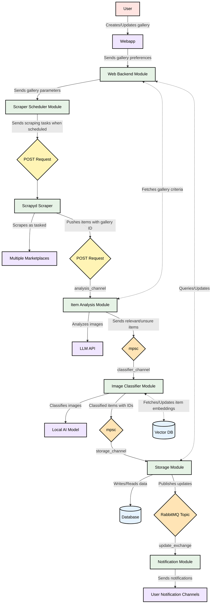

# Specifications
## High Level Overview

## General Flow for Galleries
### Web Backend
This is where a **gallery** starts. 

A gallery is a set of marketplace listings that have been scraped and LLM-analysed according to user specifications,
then grouped using an AI image classifier.

The following things are specified for a gallery:
- A generated gallery ID
- Marketplaces to scrape, ie eBay, Mercari, Carousell
- Search criteria for each/all marketplace(s) (**TBD**: possible to apply 1 search criteria across all marketplaces?)
- Scraping periodicity (written as a Cron schedule)
- What to ask the LLM about each item, known as **evaluation criteria** (explained later)

Every time a gallery is created, modified or deleted, it is passed to the **Scraper Scheduler**.

### Scraper Scheduler
Stores a list of active galleries.

This list is loaded from storage on startup, and updated on the fly from the web backend. (**TBD**: periodically sync with storage too?).

For each gallery, a `tokio-cron-scheduler` job is scheduled using the gallery's Cron schedule string. If the gallery is newly added, the job starts immediately;
if updated, it starts whenever the previous schedule says so.

Every time a gallery's job starts, its previous run datetime is updated in storage. This is so that, upon app startup, each gallery can continue following its previous
schedule, instead of all starting immediately.

A job simply fires a scraping request to the **Scraper** module. A scraping request consists of:
- The gallery ID (to tag scraped items with)
- The marketplace(s) to scrape
- The marketplace(s) search criteria
- The marketplace(s) datetime of the latest item scraped during last scraping run (ie, stop scraping here)
- The LLM evaluation criteria

Each request has the context for all modules downstream. Each module simply takes out whatever data it needs, then pushes the rest to the next module.
This negates the need for additional storage queries later on (except the query for image embeddings), keeping data flow simpler.

### Scraper
This module does the actual scraping.

**TBD**: Scraper is currently a Scrapyd instance, but we can alternatively create another Rust module to orchestrate Scrapy spiders through CLI, then have an Axum endpoint in the module 
to receive scraped items.

The scraper has separate spiders for each marketplace. Each spider will scrape its marketplace according to the given search criteria, up to the datetime of the given latest last item.
The following is then outputted to the **Item Analysis** module:
- Gallery ID
- Marketplace scraped
- Datetime of the latest item scraped's upload/update for the marketplace (to replace the previous one)
- Scraped items 
- The LLM evaluation criteria

**TBD**: If we go with a Rust scraper module, these will be passed back from the spider to the scraper module first.

### Item Analysis
This module passes information about each scraped item (including images) to an LLM, asks it some user-defined questions, and parses the answers. These questions are known as the
**evaluation criteria**; there are the following types:
- Yes/No, eg "Is this a shirt?"
- Yes/No/Uncertain, eg "Do you think this shirt fits the modern style?"
- Numerical, eg "Rate this shirt out of 0-10."
- Open-Ended, eg "Summarize your thoughts on this shirt."

Uniquely, Yes/No questions can be used to **filter out** irrelevant items, which:
- Will not be image-classified
- Will not have its images locally stored
- Will not normally be shown to user
    - However, a table with basic information for them will be available
    - Users can **re-label** items here as relevant, re-queuing them to be processed (**TBD**: implement later on)

The LLM is also given an instruction beforehand about how to answer each type of question, so that it can be properly parsed afterwards. 

**TBD**: If certain parts/the entire answer is unparsable, what do we do?

The following is then output to the **Image Classifier** module:
- Gallery ID
- List of relevant items
- List of irrelevant items
- List of error items? **TBD**

### Image Classifier
This module classifies items by what they are, allowing users to eventually view data for each unique item. 

For each gallery, a vector of embeddings is stored. This is queried and used by the AI to see if each item belongs to a pre-existing group, or
if it doesn't, creates a new group for that item, adding its image embeddings to storage.

**TBD**: I have 0 idea how to implement all of this, will figure out later

WIP

### Storage
This is the global interface for storage. Any module can query for items from here.

